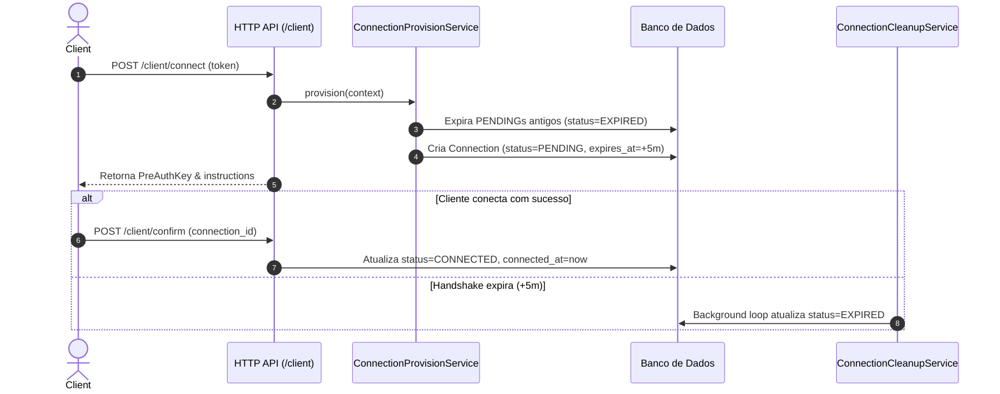
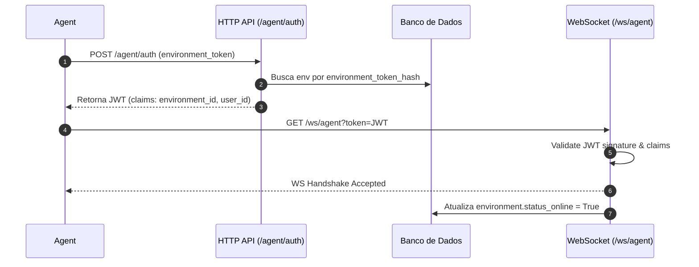

# Análise Técnica e Reflexiva: Headscale, Connections e Sincronização de Estado na Cloud Control API

Este documento apresenta o diagnóstico técnico completo da **Cloud Control API**, analisando o estado atual de `connections`, a integração com o **Headscale**, o relacionamento entre entidades e ambientes, mecanismos de comunicação com os **Agents**, riscos de segurança e desempenho, bem como a identificação dos pontos de extensão para uma futura sincronização periódica e segura de estado: **Headscale → Cloud Control API → Agent → Environment**.

---

## 1. Estado Atual das Connections

### Finalidade Real da Tabela/Modelo `connections`
O modelo `Connection` ([app/models/connection.py](file:///home/douglas/Documents/project_tcc/cloud_control_api/app/models/connection.py)) registra o ciclo de vida do **handshake de autorização de acesso** de clientes externos a contêineres publicados.

Atualmente, possui os seguintes campos:
*   `id` (`Integer`): Chave primária autoincrementável.
*   `published_container_id` (`String(36)`): FK para `published_containers.id` (`ondelete="CASCADE"`).
*   `access_token_id` (`Integer`): FK para `access_tokens.id` (`ondelete="RESTRICT"`).
*   `headscale_preauth_key_id` (`String(36)`): FK para `headscale_preauth_keys.id` (`ondelete="RESTRICT"`).
*   `status` (`String(50)`): Estado da conexão (`PENDING`, `CONNECTED`, `EXPIRED`).
*   `expires_at` (`DateTime`): Timestamp limite para conclusão do handshake (TTL de 5 minutos por padrão).
*   `connected_at` (`DateTime`): Timestamp em que o handshake de conexão foi confirmado pelo cliente.

### Estados Existentes
Definidos no Enum `ConnectionStatus` ([app/models/connection_status.py](file:///home/douglas/Documents/project_tcc/cloud_control_api/app/models/connection_status.py)):
1.  **`PENDING`**: A conexão foi autorizada pela Cloud API, uma `PreAuthKey` foi gerada no Headscale, e o sistema aguarda que o cliente execute o `tailscale up` e confirme o handshake.
2.  **`CONNECTED`**: O cliente confirmou o acesso com sucesso invocando o endpoint `POST /client/confirm` ([app/services/client_connection_confirm_service.py](file:///home/douglas/Documents/project_tcc/cloud_control_api/app/services/client_connection_confirm_service.py)).
3.  **`EXPIRED`**: A autorização expirou antes do envio da confirmação pelo cliente (passou do `expires_at`), ou foi invalidada porque um novo pedido de conexão foi gerado para o mesmo `access_token_id`.

> [!WARNING]
> **Estado `DISCONNECTED` Inexistente**: O modelo `ConnectionStatus` **NÃO possui** o estado `DISCONNECTED`, nem tampouco campos como `disconnected_at` ou `ended_at`. O sistema não registra o encerramento de conexões ou sessões encerradas no nível de rede.

### Ciclo de Vida: Criação e Atualização



1.  **Criação**: Executada no método `ConnectionProvisionService.provision()` ([app/services/connection_provision_service.py](file:///home/douglas/Documents/project_tcc/cloud_control_api/app/services/connection_provision_service.py#L67)), chamado durante o fluxo de `POST /client/connect`. O registro é criado com status `PENDING` e TTL padrão de 5 minutos.
2.  **Atualização**:
    *   Transicionada para `CONNECTED` em `ClientConnectionConfirmService.confirm()` quando a API recebe `POST /client/confirm`.
    *   Transicionada para `EXPIRED` pelo `ConnectionCleanupService.cleanup_expired_pending_connections()` ([app/services/connection_cleanup_service.py](file:///home/douglas/Documents/project_tcc/cloud_control_api/app/services/connection_cleanup_service.py)), executado na inicialização e periodicamente em background a cada 180 segundos via `asyncio.create_task` em `main.py` ([app/main.py](file:///home/douglas/Documents/project_tcc/cloud_control_api/app/main.py#L19-L44)).

### Significado Real do Estado
O estado atual da tabela `connections` representa **exclusivamente um registro operacional e histórico do fluxo de autorização HTTP**. Ele indica apenas se a emissão da chave e a confirmação do cliente foram concluídas. **Não representa o estado real e contínuo da conexão VPN no Headscale** (ou seja, se a máquina continua online, transmitindo dados ou se desconectou).

---

## 2. Integração Atual com o Headscale

### Arquitetura de Módulos
A integração com o Headscale está dividida em duas camadas desacopladas:

1.  **Camada de Integração Low-Level (`app/integrations/headscale/`)**:
    *   `RestHeadscaleClient` ([client.py](file:///home/douglas/Documents/project_tcc/cloud_control_api/app/integrations/headscale/client.py)): Implementa `IHeadscaleClient` usando `httpx.Client` síncrono.
    *   `CircuitBreaker` ([client.py:L89-L96](file:///home/douglas/Documents/project_tcc/cloud_control_api/app/integrations/headscale/client.py#L89-L96)): Protege chamadas HTTP (`failure_threshold=4`, `recovery_timeout=20.0s`).
    *   `HeadscaleMapper` ([mapper.py](file:///home/douglas/Documents/project_tcc/cloud_control_api/app/integrations/headscale/mapper.py)): Converte DTOs de resposta REST em modelos internos de integração.
    *   `exceptions.py` ([exceptions.py](file:///home/douglas/Documents/project_tcc/cloud_control_api/app/integrations/headscale/exceptions.py)): Abstração de exceções (`HeadscaleConnectionError`, `HeadscaleNotFoundError`, etc.).

2.  **Camada de Serviços de Domínio (`app/services/headscale/`)**:
    *   `HeadscaleUserService`: Gerencia usuários no Headscale.
    *   `HeadscalePreAuthKeyService`: Emite e expira PreAuthKeys.
    *   `HeadscaleNodeService`: Lista, renomeia, altera proprietário e deleta nós no Headscale.
    *   `HeadscaleProvisioningService`: Coordena a criação do usuário e da chave para o ambiente/container.
    *   `ProvisioningOrchestrator`: Avalia decisões de provisionamento (`ProvisioningDecisionService`) e envia eventos WebSocket aos Agents.

### Endpoints REST do Headscale Utilizados
*   **Usuários**:
    *   `POST /api/v1/user`
    *   `GET /api/v1/user`
    *   `DELETE /api/v1/user/{name}`
    *   `POST /api/v1/user/{old_name}/rename/{new_name}`
*   **Chaves de Pré-autenticação (PreAuthKeys)**:
    *   `POST /api/v1/preauthkey`
    *   `POST /api/v1/preauthkey/expire`
    *   `GET /api/v1/preauthkey` (filtrado por `user`)
*   **Nós (Nodes)**:
    *   `GET /api/v1/node` (listagem global ou por usuário)
    *   `GET /api/v1/node/{id}`
    *   `DELETE /api/v1/node/{id}`
    *   `POST /api/v1/node/{id}/rename/{new_name}`
    *   `POST /api/v1/node/{id}/user`

### Consulta Equivalente a `node list`
**Sim, existe**. O método `RestHeadscaleClient.list_nodes(user: Optional[str] = None)` ([client.py:L257](file:///home/douglas/Documents/project_tcc/cloud_control_api/app/integrations/headscale/client.py#L257)) consulta `GET /api/v1/node`.
*   Quando o argumento `user` é `None`, o Headscale retorna a **listagem global de todos os nós de todos os usuários**.
*   Quando o argumento `user` é informado (ex: `env_<environment_id>`), o Headscale retorna apenas os nós pertencentes àquele usuário/ambiente.
*   Esse método é exposto na camada de serviço em `HeadscaleNodeService.list(user: Optional[str] = None)` ([node_service.py:L33](file:///home/douglas/Documents/project_tcc/cloud_control_api/app/services/headscale/node_service.py#L33)).

---

## 3. Relacionamento entre Identidade e Ambiente

### Mapeamento do Modelo de Dados

```
User (Cloud Administrator / Account Owner)
 ↓ (1:N) [environments.user_id -> users.id]
Environment
 ├── (1:1) [headscale_users.environment_id -> environments.id] -> HeadscaleUser (env_<environment_id>)
 ├── (1:N) [published_containers.environment_id -> environments.id] -> PublishedContainer
 └── (Sessão WebSocket em Memória) -> Agent (identificado via JWT environment_id)

PublishedContainer
 ├── (1:1) [published_nodes.published_container_id -> published_containers.id] -> PublishedNode (dados locais do Agent)
 ├── (1:N) [access_tokens.published_container_id -> published_containers.id] -> AccessToken
 ├── (1:N) [headscale_preauth_keys.published_container_id -> published_containers.id] -> HeadscalePreAuthKey
 └── (1:N) [connections.published_container_id -> published_containers.id] -> Connection

HeadscaleUser
 ├── (1:N) [headscale_preauth_keys.headscale_user_id -> headscale_users.id] -> HeadscalePreAuthKey
 └── (1:N) [headscale_nodes.headscale_user_id -> headscale_users.id] -> HeadscaleNode (registrado na API Headscale)

Connection
 ├── (N:1) -> PublishedContainer
 ├── (N:1) -> AccessToken
 └── (N:1) -> HeadscalePreAuthKey
```

### Relacionamentos Existentes no Código
1.  `User` → `Environment`: Relação 1:N via `user_id`.
2.  `Environment` → `HeadscaleUser`: Relação 1:1 estrita com constraint `unique=True` em `headscale_users.environment_id`. O nome do usuário Headscale é padronizado como `env_<environment_id>`.
3.  `Environment` → `PublishedContainer`: Relação 1:N via `environment_id`.
4.  `PublishedContainer` → `PublishedNode`: Relação 1:1 via `published_container_id`. Armazena o estado do Tailscale local reportado pelo Agent via snapshot (`installed`, `service_running`, `machine_id`, `node_key`, `tailscale_ip`, `online`, `last_sync`).
5.  `PublishedContainer` → `AccessToken`: Relação 1:N via `published_container_id`.
6.  `PublishedContainer` → `Connection`: Relação 1:N via `published_container_id`.
7.  `AccessToken` → `Connection`: Relação 1:N via `access_token_id`.
8.  `HeadscalePreAuthKey` → `Connection`: Relação 1:N via `headscale_preauth_key_id`.
9.  `HeadscaleUser` → `HeadscaleNode`: Relação 1:N via `headscale_user_id`.

### Relacionamentos Inexistentes (Lacunas no Modelo)
*   **Agent**: Não existe entidade ou tabela `agents` no banco de dados. O Agent é um conceito em memória autenticado via JWT associado a um `Environment`.
*   **Connection → HeadscaleNode**: Não existe chave estrangeira ou ponte direta ligando a autorização `Connection` ao nó real cadastrado no Headscale (`HeadscaleNode` ou `PublishedNode`).
*   **PublishedNode vs HeadscaleNode**: Existem duas tabelas separadas para representar o nó. `PublishedNode` é populado via snapshot do Agent, enquanto `HeadscaleNode` é populado via API do Headscale. Elas não possuem vínculo direto entre si no banco.

---

## 4. Isolamento entre Ambientes e Segurança

### Como a Cloud garante o isolamento
1.  **Isolamento de Dados do Agent**:
    *   O Agent se autentica em `POST /agent/auth` enviando o `environment_token`. A Cloud valida o hash em `environments.environment_token_hash` e emite um JWT de curta duração contendo o claim `environment_id`.
    *   No handshake WebSocket (`/ws/agent?token=<JWT>`), a Cloud valida o JWT e registra a conexão no `ConnectionManager` indexada por `environment_id`.
    *   As operações de sincronização (`EnvironmentSyncService.sync(environment_id, snapshot)`) operam exclusivamente dentro do escopo do `environment_id` autenticado.
2.  **Isolamento entre Usuários da Cloud**:
    *   Rotas administrativas utilizam a dependência `get_current_user` para garantir que o usuário autenticado é o proprietário do ambiente.
3.  **Isolamento no Headscale**:
    *   Como cada ambiente possui um usuário exclusivo no Headscale (`env_<environment_id>`), os nós de um ambiente pertencem ao seu respectivo Headscale User, impedindo contaminação cruzada.

### Vulnerabilidades e Pontos de Confiança Excessiva Identificados

> [!CAUTION]
> **Vulnerabilidade Crítica de Segurança em `POST /client/confirm`**:
> O endpoint `/client/confirm` ([app/api/client.py:L72](file:///home/douglas/Documents/project_tcc/cloud_control_api/app/api/client.py#L72)) aceita o DTO `ClientConnectionConfirmRequestDTO(connection_id: int)`.
> *   O endpoint **não possui autenticação** (não exige JWT de usuário nem de Agent).
> *   O endpoint **não valida ownership** nem exige token/hash de confirmação.
> *   Como `Connection.id` usa inteiros autoincrementáveis previsíveis, **qualquer cliente pode enumerar IDs de conexão** (`1, 2, 3...`) e alterar seu status para `CONNECTED` arbitrariamente.

> [!WARNING]
> **Identificadores Sequenciais Previsíveis (IDOR)**:
> As tabelas `connections`, `access_tokens`, `published_containers` e `published_nodes` utilizam chaves primárias numéricas autoincrementáveis. Recomenda-se a migração para UUIDs v4 para evitar enumeração de recursos.

---

## 5. Comunicação Cloud → Agent

### Endpoints de Comunicação com o Agent
1.  `POST /agent/auth` ([app/controllers/agent.py](file:///home/douglas/Documents/project_tcc/cloud_control_api/app/controllers/agent.py)): Endpoint HTTP para troca do `environment_token` estático por um JWT de Agent.
2.  `GET /ws/agent?token=<JWT>` ([app/realtime/websocket.py](file:///home/douglas/Documents/project_tcc/cloud_control_api/app/realtime/websocket.py)): Endpoint WebSocket para comunicação bidirecional contínua.

### Autenticação do Agent
O Agent realiza o boot e envia o token do ambiente via HTTP POST. A Cloud valida o hash SHA-256 e responde com um JWT assinado contendo os claims `environment_id`, `user_id` e `type="agent"`. Esse JWT é passado como query parameter no handshake do WebSocket.



### Mecanismos de Comunicação Reutilizáveis
*   **WebSocket Persistente**: Gerenciado por `ConnectionManager` ([app/realtime/connection_manager.py](file:///home/douglas/Documents/project_tcc/cloud_control_api/app/realtime/connection_manager.py)) mantendo o estado das conexões ativas em `dict[str, Connection]`.
*   **Padrão Request-Response**: A Cloud pode emitir mensagens (ex: `environment.sync`) para o Agent e aguardar a resposta assíncrona por `request_id` via `asyncio.Future`.
*   **Dispatch de Eventos Cloud → Agent**: O `ProvisioningOrchestrator` envia mensagens WebSocket do tipo `container.provision` contendo `preauth_key`, `headscale_url` e `headscale_user`.
*   **Eventos Agent → Cloud**: O Agent pode enviar `event.publish` ou `environment.changed`, que acionam o `EventHandler` para disparar re-sincronizações do ambiente.

---

## 6. Pontos de Extensão para Futura Sincronização de Estado

A sincronização de estado periódica desejada seguirá o fluxo:
$$\text{Scheduler} \longrightarrow \text{Headscale} \longrightarrow \text{Detectar Mudanças} \longrightarrow \text{Atualizar Connections / Nodes} \longrightarrow \text{Gerar Mudanças Pendentes} \longrightarrow \text{Agent Notificado/Aplica}$$

Os pontos exatos de extensão no código atual são:

```
[app/main.py] (lifespan)
   │ (1) Inicia Scheduler em background
   ▼
[app/services/headscale/node_service.py]
   │ (2) Invoca list_nodes() globalmente no Headscale
   ▼
[HeadscaleStateSyncService] (Novo Serviço)
   │ (3) Compara DTOs com DB (headscale_nodes, published_nodes, connections)
   ▼
[app/repositories/]
   │ (4) Atualiza status dos nós e marca Connections como EXPIRED/CONNECTED
   ▼
[app/realtime/connection_manager.py]
   │ (5) Se houver delta e Agent estiver online: envia mensagem leve WS
   ▼
[Agent] (Recebe delta via WebSocket)
```

1.  **Scheduler (Ponto de Entrada)**:
    *   Local: `lifespan` em [app/main.py](file:///home/douglas/Documents/project_tcc/cloud_control_api/app/main.py#L19-L53).
    *   Onde incluir: O código já possui a estrutura `_background_connection_cleanup_loop`. Pode-se registrar um novo loop assíncrono para o scheduler de sincronização (`_background_headscale_sync_loop`).
2.  **Consulta ao Headscale**:
    *   Local: `HeadscaleNodeService.list()` em [app/services/headscale/node_service.py:L33](file:///home/douglas/Documents/project_tcc/cloud_control_api/app/services/headscale/node_service.py#L33).
    *   Onde incluir: Chama `RestHeadscaleClient.list_nodes(user=None)` para obter o snapshot completo de todas as máquinas conectadas à VPN.
3.  **Mecanismo de Detecção de Mudanças (Diff Engine)**:
    *   Local: Novo serviço em `app/services/headscale/` (ex: `HeadscaleStateSyncService`).
    *   Onde incluir: Comparar a lista de nós da API do Headscale com os registros persistidos nas tabelas `headscale_nodes` e `published_nodes` usando `machine_key` ou `node_key`.
4.  **Atualização de Persistência (`connections` / `published_nodes`)**:
    *   Local: `HeadscaleNodeRepository`, `PublishedNodeRepository` e `ConnectionRepository`.
    *   Onde incluir: Atualizar o campo `online`, `last_seen` e expirar `connections` cujas chaves foram consumidas ou cujos nós foram removidos.
5.  **Notificação Incremental ao Agent**:
    *   Local: `ConnectionManager.send(environment_id, message)` em [app/realtime/connection_manager.py](file:///home/douglas/Documents/project_tcc/cloud_control_api/app/realtime/connection_manager.py).
    *   Onde incluir: Quando um delta for detectado para um container/nó de um ambiente online, enviar uma mensagem WebSocket leve (`type="node.status_changed"`) em vez de solicitar o snapshot completo.

---

## 7. Desempenho e Escalabilidade

### Consulta Global vs Consulta Por Usuário
*   Se a Cloud realizasse 1 chamada ao Headscale por usuário/ambiente (`GET /api/v1/node?user=env_X`), o número de requisições HTTP cresceria linearmente com o número de ambientes (\(O(N)\)).
*   O método `RestHeadscaleClient.list_nodes(user=None)` executa `GET /api/v1/node` sem parâmetros, trazendo **todos os nós do Headscale em uma única requisição HTTP** (\(O(1)\) em chamadas de rede).

### Mecanismos de Proteção Existentes
*   **Circuit Breaker**: O `RestHeadscaleClient` inclui um `CircuitBreaker` ([client.py:L89](file:///home/douglas/Documents/project_tcc/cloud_control_api/app/integrations/headscale/client.py#L89)) que interrompe chamadas se ocorrerem 4 falhas consecutivas, mantendo um tempo de recuperação de 20 segundos.
*   **Diff em Memória**: Mapear as respostas do Headscale por chave de máquina (`machine_key`) em dicionários Python permite comparar milhares de nós em poucos milissegundos.
*   **Comunicação Seletiva com Agents**: A Cloud só deve disparar eventos WebSocket para os Agents quando um delta significativo de estado for detectado, evitando tráfego desnecessário na rede.

---

## 8. Consistência e Fonte de Verdade

### Inconsistências Identificadas no Modelo Atual
1.  **Tabelas de Nó Duplicadas**:
    *   `published_nodes`: Populada reativamente via snapshot WebSocket do Agent.
    *   `headscale_nodes`: Populada via API do Headscale.
    *   *Risco*: Se o Agent perder conectividade, `published_nodes` mostrará o nó como desatualizado mesmo que ele esteja registrado e ativo no servidor Headscale.
2.  **Estado Transitório em `connections`**:
    *   A tabela `connections` fica presa em `PENDING` se o cliente não chamar `/client/confirm`, mesmo que a máquina tenha se registrado no Headscale com sucesso.
3.  **Visão do Frontend**:
    *   O frontend consulta o banco da Cloud. Sem a sincronização periódica entre a Cloud e o Headscale, o status exibido no painel depende exclusivamente dos heartbeats do Agent.

### Matriz de Fonte de Verdade (Source of Truth)

| Domínio de Informação | Fonte de Verdade (SoT) | Justificativa |
| :--- | :--- | :--- |
| **Topologia da VPN, Registro de Nós, IPs e Status Online da VPN** | **Headscale Control Server** | É o servidor de controle central da rede Tailscale/WireGuard. |
| **Identidade de Usuários, Ambientes, Tokens e Autorizações de Acesso** | **Cloud Control API (PostgreSQL)** | É o painel de controle que define quem tem permissão de conectar a qual container. |
| **Execução e Ciclo de Vida dos Containers (Running/Stopped)** | **Agent (Host de Containers)** | O Agent está fisicamente no host e consulta o daemon Docker/Proxmox local. |

---

## 9. Conclusão e Recomendações

### Infraestrutura Reutilizável
*   `RestHeadscaleClient`: Cliente HTTP com suporte a listagem global de nós, retries e circuit breaker.
*   `HeadscaleNodeService` e `ProvisioningOrchestrator`: Camada de serviço pronta para abstrair operações no Headscale.
*   `ConnectionManager`: Gerenciamento de websockets ativos por ambiente com envio de eventos assíncronos.
*   `main.py` lifespan: Suporte nativo para registro de tarefas agendadas em segundo plano (`asyncio.create_task`).

### Resumo dos Riscos Identificados

> [!CAUTION]
> **Risco de Segurança**: O endpoint `POST /client/confirm` é desprotegido e aceita IDs inteiros autoincrementáveis, permitindo ataques de enumeração e alteração indevida do estado de conexões.

> [!WARNING]
> **Risco de Inconsistência**: Duplicidade entre `published_nodes` e `headscale_nodes` e ausência do estado `DISCONNECTED` na tabela `connections`.

### Decisões Arquiteturais Necessárias Antes da Implementação
1.  **Segurança do Endpoint `/client/confirm`**: Substituir a confirmação por ID numérico simples por um token assinado (JWT ou UUID único de uso único enviado na autorização).
2.  **Unificação da Representação do Nó**: Definir se `published_nodes` será consolidado com `headscale_nodes` ou se `published_nodes` manterá apenas métricas do agente local enquanto `headscale_nodes` representa a VPN.
3.  **Refatoração do Modelo `connections`**:
    *   Adicionar UUIDs para identificação externa.
    *   Adicionar os estados `DISCONNECTED` e `REVOKED` no enum `ConnectionStatus`.
    *   Adicionar timestamps `disconnected_at` e campo de vínculo `headscale_node_id`.
4.  **Definição do Intervalo do Scheduler**: Estabelecer um intervalo razoável (ex: 15 a 30 segundos) para a consulta global ao Headscale no `lifespan` do FastAPI.
